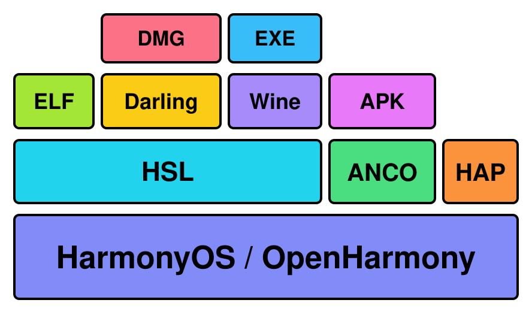

<h1 align="center">Hi Subsystem for Linux (HSL)</h1>

Hi Subsystem for Linux (HSL) 是一个用于在新操作系统上运行 Linux 应用程序的兼容层。通过模拟 Linux 系统环境而不是整个主机，HSL 能以极高的性能（99~99.8%）运行未修改的原生 Linux 应用程序。 和虚拟机不同， HSL 几乎没有额外开销且包含原生网络支持。

目前， HSL 仅支持 ARM64 架构的 HarmonyOS/OpenHarmony 系统。

## 特性

- Alpine rootfs 支持
- Ubuntu chroot 支持
- sshd
- 完全的 root 权限
- glibc 支持
- Python3 兼容
- NodeJS 兼容
- GPU 加速支持
- IPv6 的原生网络套接字
- 基础的x11支持
- Windows ARM64 应用程序支持（通过wine）

## 即将支持

- Ubuntu rootfs
- x11VNC
- 鸿蒙 PC 原生窗口（Undercover风格）
- 专门为鸿蒙优化的 Proton
- 更好用的explorer
- Windows x86_64 应用程序
- Linux x86_64 应用程序 (目前通过 box64 以支持命令行程序, 正在向 FEX 迁移以获得更高性能)
- JIT-less mode（V8 和 JVM 需要关闭 JIT 以提高性能）
- Docker (也许需要重度修改才能运行)

## 顺便一提

1. 早期 HSL 使用 WebAssembly 提供真正的 Linux 内核，但后来被证明并不需要塞一个内核进去也能用。
2. V社两周前发布了他们第一款ARM64设备，对HSL来说是好事，特别是游戏的兼容性。你真的可以期待以后在鸿蒙PC上玩大型3A。
3. 在找完整的 Linux ？看看[HiSH](https://github.com/harmoninux/hiSH)吧

## 关于开源

等我清理完史山之后我会提交源代码并设置一个不错的许可证

## Credits

Original Tux image by Larry Ewing <lewing@isc.tamu.edu>, created with The GIMP. Modified by JulieSapir.
